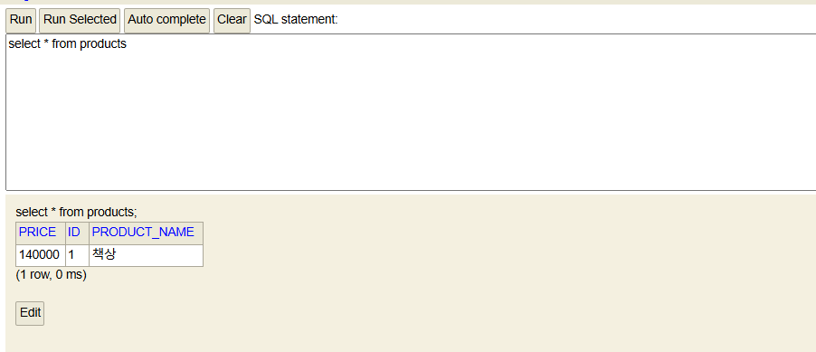

## **HTTP**
- HTTP: HyperText Transfer Protocol
- https:// 프로토콜: 통신 규칙
- www.google.com 호스트: 서버의 주소
- /serach 경로: 호스트 내 서비스의 위치, 서비스 별로 분할
- ?q=techit 쿼리 문자열: ? 기호로 시작, &로 연결, 키/값 쌍으로 구성

## **쿠키와 세션*
- 쿠키 덕분에 로그인 풀리지 않음
- 민감한 정보는 포함 x
- 세션
- 쿠키 단점 보완
- 서버는 쿠키 하나만 주고 정보는 세션 저장소에 담아놓음

- 네트워크에서 호스트 간 통신 가능하게 스위치 사용
- 인터넷: 네트워크와 네트워크가 연결된 거대 통신망

## **IP**
- IP -Internet Protocol
- 컴퓨터 간 데이터를 주고받는 네트워크 계층의 규약
- 데이터 전달에 필요한 목적지 컴퓨터 정보가 필요
- IP 주소: 네트워크에서 컴퓨터가 부여받는 고유한 주소
- 32비트 주소 8비트씩 분할, 8비트 단위: 옥텟, 2진수를 10진수로 변환
- 공인 IP 주소: 전체 인터넷 망에서 고유하게 식별 가능 주소
- 하나의 공인 IP에서 많은 사설 IP 할당 가능
- 사설 IP: 가정의 LAN과 같은 네트워크에서 할당되는 주소, 컴퓨터에서 조회되는 IP
- lo: Loopback Network Interface, 자기 자신인 localhost

## **DNS**
- DNS: URL을 해석하여 IP 주소로 변환하는 서버

## **CRUD**
- CRUD: Create 저장, Read 열람, Update 변경, Destroy 삭제
- RDBMS(관계형 데이터베이스): 표 형식으로 데이터 관리 ex) Sqlite, mySQL, Postgresql

